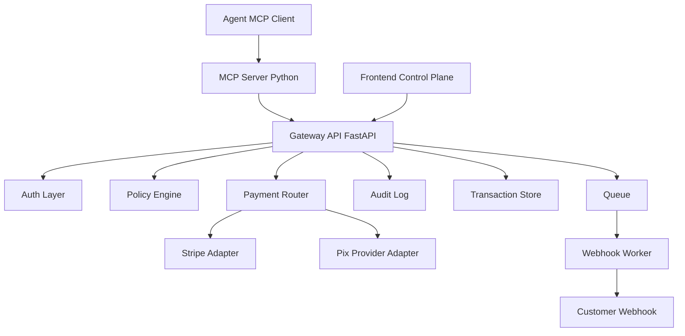
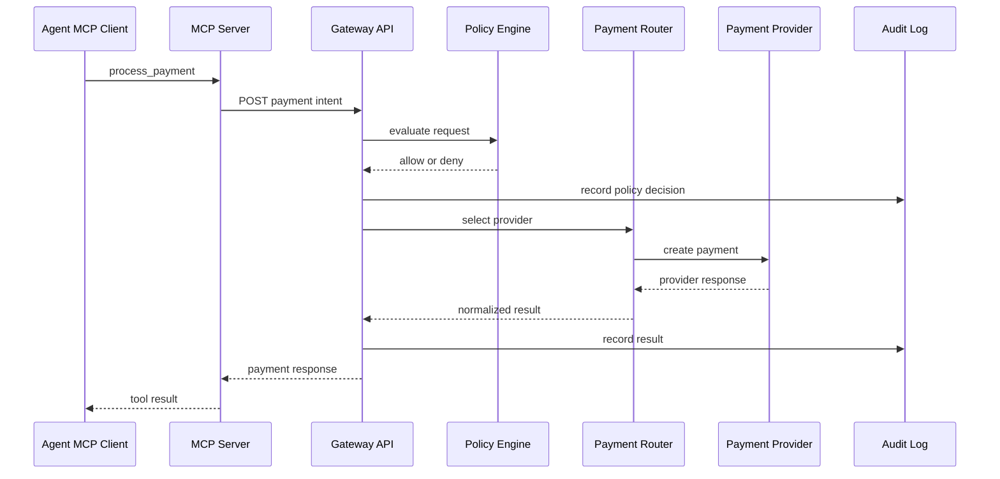

# Architecture Overview

## Objetivo

O SkillPay e um gateway MCP-first que permite que agentes de IA iniciem, consultem e revertam pagamentos por meio de tools MCP controladas por politicas deterministicas. O produto deve atuar como camada de orquestracao e auditoria sobre providers regulados, nao como liquidante.

Do ponto de vista de negocio, o SkillPay pode evoluir para capturar receita de gateway por meio de fees e margem transacional. Essa evolucao nao deve mudar a fronteira tecnica inicial: agentes continuam chamando o SkillPay, o policy engine decide se a acao pode seguir, e providers regulados continuam responsaveis pela captura, liquidacao e obrigações financeiras do pagamento.

## Visao Geral

## Componentes

### MCP Server

Responsavel por expor as tools consumidas por agentes:

- `process_payment`;
- `check_status`;
- `refund`.

O MCP server deve ser uma camada fina. Ele autentica a chamada, valida o contrato basico e delega a decisao para a Gateway API. Ele nao deve chamar providers diretamente.

### Gateway API

Responsavel por concentrar a regra de negocio do gateway:

- autenticacao de API keys e agentes;
- validacao de payloads com Pydantic;
- aplicacao do policy engine;
- criacao e consulta de transacoes;
- roteamento para providers;
- registro de auditoria;
- emissao de eventos para workers.

### Policy Engine

Camada obrigatoria antes de qualquer chamada a provider. Ela decide se uma solicitacao pode seguir com base em:

- permissao do agente;
- limites de valor;
- limites por frequencia;
- metodo de pagamento permitido;
- moeda permitida;
- modo sandbox ou producao;
- risco basico do payload.

### Payment Router

Seleciona o provider de pagamento com regras simples no MVP. Exemplos:

- `BRL` + `pix` segue para provider Pix;
- `USD` + `card` segue para Stripe;
- transacao sandbox usa provider simulado;
- provider indisponivel bloqueia ou redireciona somente se houver regra explicita.

Roteamento por machine learning fica fora do MVP.

### Provider Adapters

Cada adapter encapsula uma integracao externa. O contrato interno deve ser estavel, mesmo que cada provider use campos diferentes.

Responsabilidades:

- converter payload interno para o formato do provider;
- chamar APIs externas;
- normalizar respostas;
- traduzir erros;
- expor status padronizado para o gateway.

Adapters tambem sao a fronteira onde, no futuro, o SkillPay pode capturar margem transacional por meio de contratos comerciais com providers. Essa decisao deve permanecer fora da regra de negocio do agente: o agente solicita uma acao financeira, o gateway aplica politica e o router escolhe o provider conforme configuracao explicita.

### Transaction Store

Banco transacional para entidades como:

- workspace;
- agent;
- API key;
- provider account;
- payment transaction;
- refund;
- audit event;
- webhook delivery.

### Audit Log

Registro imutavel do que ocorreu em cada tool call. Deve permitir responder:

- qual agente iniciou a acao;
- qual workspace autorizou;
- qual payload foi recebido;
- quais politicas foram avaliadas;
- qual provider foi escolhido;
- qual foi o resultado final.

### Frontend Control Plane

Interface administrativa para operadores humanos. O frontend deve permitir configurar, simular e auditar o gateway, mas nao deve guardar segredos sensiveis nem executar regra financeira localmente.

## Fluxo de Processamento

## Fronteiras de Seguranca

- Agentes nunca falam diretamente com providers.
- Frontend nunca executa pagamentos diretamente.
- Providers nunca recebem payload cru do agente sem normalizacao.
- Toda tool call deve gerar audit log.
- Toda decisao de pagamento deve passar pelo policy engine.

## Modos de Operacao

### Sandbox

Usado para onboarding e testes. Deve simular sucesso, falha, expiracao e refund sem movimentar dinheiro real.

### Producao

Usado somente com provider configurado, agente autorizado e limites ativos. Deve exigir credenciais validas e mascarar dados sensiveis nos logs.

Em producao, o MVP deve operar com providers regulados configurados pelo workspace ou pela plataforma. Mesmo que haja fee transacional do SkillPay, o sistema nao deve custodiar saldo nem assumir liquidacao propria no primeiro ciclo.

## Decisoes Fora do MVP

- Licenca propria de subadquirencia.
- Custodia de saldo.
- Split de pagamento.
- Roteamento por ML.
- Checkout hospedado para humanos.
- Marketplace de agentes.
