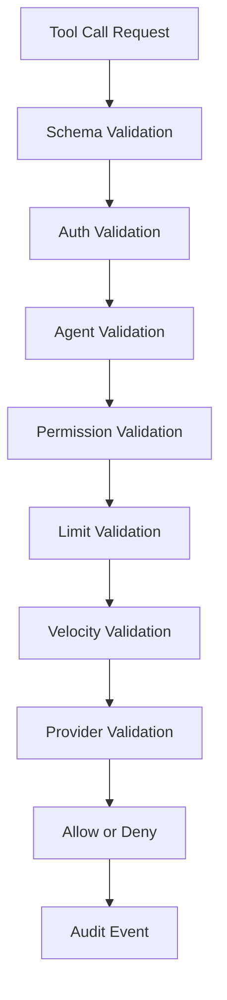

# Policy Engine

## Objetivo

O policy engine e a camada deterministica que decide se uma acao financeira solicitada por agente pode seguir. Ele deve executar antes de qualquer chamada a provider e deve registrar sua decisao em audit log.

## Principio Central

Agentes podem gerar payloads incompletos, maliciosos ou alucinados. Por isso, nenhuma tool call deve ser considerada confiavel apenas porque veio de um cliente MCP autenticado.

## Ordem de Avaliacao



## Regras Minimas

### Schema Validation

- Rejeitar campos desconhecidos.
- Rejeitar tipos incorretos.
- Rejeitar valor monetario nao inteiro.
- Rejeitar moeda fora do padrao ISO 4217.
- Rejeitar metadata acima do limite de tamanho.

### Auth Validation

- API key deve existir.
- API key deve estar ativa.
- API key deve pertencer ao workspace.
- Ambiente da API key deve bater com a operacao: sandbox ou producao.

### Agent Validation

- `agent_id` deve existir no workspace.
- agente deve estar ativo.
- agente deve estar autorizado para o ambiente.
- agente deve ter permissao para a tool solicitada.

### Permission Validation

Permissoes iniciais:

- `payments:create`;
- `payments:read`;
- `payments:refund`;
- `providers:read`;
- `audit:read`.

No MVP, permissoes podem ser configuradas por agente. Roles podem ser adicionadas depois.

### Limit Validation

Limites recomendados por agente:

- valor maximo por transacao;
- valor maximo diario;
- quantidade maxima de transacoes por minuto;
- quantidade maxima de transacoes por dia;
- metodos de pagamento permitidos;
- moedas permitidas;
- providers permitidos.

### Velocity Validation

Bloquear ou exigir revisao quando houver:

- repeticao excessiva de pagamentos em curto intervalo;
- muitas falhas consecutivas;
- muitas tentativas bloqueadas;
- troca brusca de valor medio;
- uso repetido de idempotency keys conflitantes.

No MVP, essas regras podem ser thresholds simples. Nao usar machine learning inicialmente.

### Provider Validation

- provider deve estar configurado para o workspace;
- provider deve suportar moeda e metodo;
- provider deve estar habilitado para o ambiente;
- fallback para outro provider so deve ocorrer se houver regra explicita.

## Decisoes

### Allow

A solicitacao segue para o payment router. O audit log deve registrar todas as regras avaliadas e o motivo da aprovacao.

### Deny

A solicitacao nao chega ao provider. O retorno deve conter motivo padronizado e seguro para consumo pelo agente.

### Manual Review

Fora do MVP. Pode ser adicionado quando houver fluxo operacional para revisao humana.

## Motivos Padronizados de Bloqueio

| Reason | Descricao |
| --- | --- |
| `invalid_schema` | Payload nao atende o contrato da tool. |
| `invalid_environment` | Chamada usa credencial de ambiente errado. |
| `agent_inactive` | Agente esta pausado ou desativado. |
| `permission_denied` | Agente nao possui permissao para a tool. |
| `amount_exceeds_agent_limit` | Valor maior que o limite por transacao. |
| `daily_amount_limit_exceeded` | Soma diaria excedida. |
| `velocity_limit_exceeded` | Frequencia de chamadas excedida. |
| `payment_method_not_allowed` | Metodo nao permitido para o agente. |
| `currency_not_allowed` | Moeda nao permitida para o agente. |
| `provider_not_configured` | Workspace nao possui provider aplicavel. |
| `provider_not_allowed` | Provider nao permitido para o agente/workspace. |

## Dados Sensiveis

Nunca registrar em texto puro:

- tokens de provider;
- API keys;
- documentos completos;
- dados completos de cartao;
- secrets de webhook;
- payloads que contenham credenciais externas.

Mascaramento recomendado:

- API key: `sk_live_****1234`;
- documento: `***.***.***-00`;
- email: `c***@example.com`;
- provider reference: manter somente se nao for segredo.

## Audit Event

Cada decisao do policy engine deve gerar evento com:

```json
{
  "correlation_id": "corr_01",
  "workspace_id": "wrk_123",
  "agent_id": "agent_sales",
  "tool": "process_payment",
  "environment": "sandbox",
  "decision": "denied",
  "reason": "amount_exceeds_agent_limit",
  "rules_evaluated": [
    "schema_validation",
    "auth_validation",
    "agent_validation",
    "limit_validation"
  ],
  "masked_payload": {
    "amount": 99900,
    "currency": "BRL",
    "payment_method": "pix",
    "customer": {
      "email": "c***@example.com",
      "document": "***.***.***-00"
    }
  },
  "created_at": "2026-05-02T14:45:00Z"
}
```

## Relacao com Frontend

O frontend deve exibir a decisao de politica de forma legivel:

- decisao;
- motivo;
- regras avaliadas;
- provider foi chamado ou nao;
- como corrigir a configuracao quando aplicavel.

Exemplo: se a transacao foi bloqueada por `amount_exceeds_agent_limit`, a tela deve indicar o limite atual do agente e apontar para a configuracao do agente.

## Relacao com MCP

O retorno para o agente deve ser util, mas nao deve vazar detalhes sensiveis. Mensagens devem ser objetivas:

- permitido: retornar status e acao necessaria;
- bloqueado: retornar codigo e motivo padronizado;
- erro interno: retornar codigo generico e `correlation_id`.

## Requisitos Para Implementacao

- O policy engine deve ser testavel isoladamente.
- Regras devem ser puras sempre que possivel.
- Toda decisao deve ser deterministica para o mesmo input e configuracao.
- Testes de unidade devem usar dados fake.
- Mudancas de regra devem atualizar este documento.
